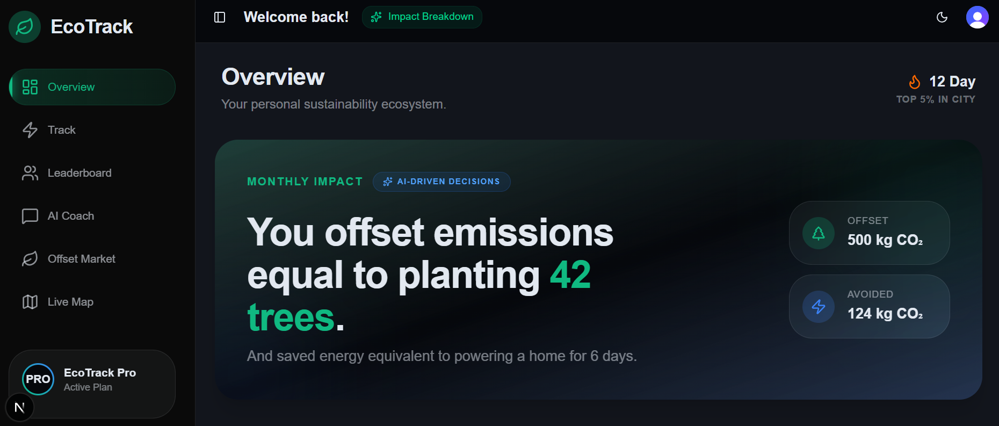
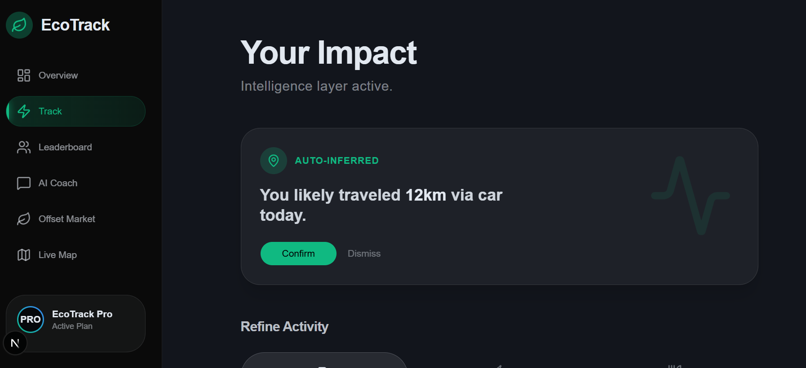
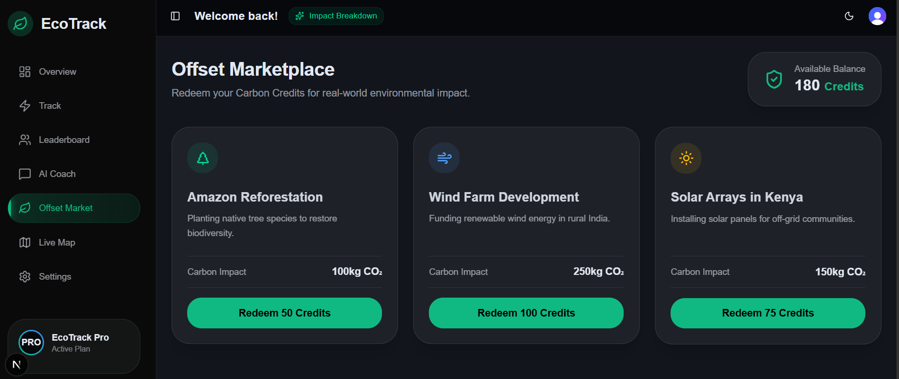
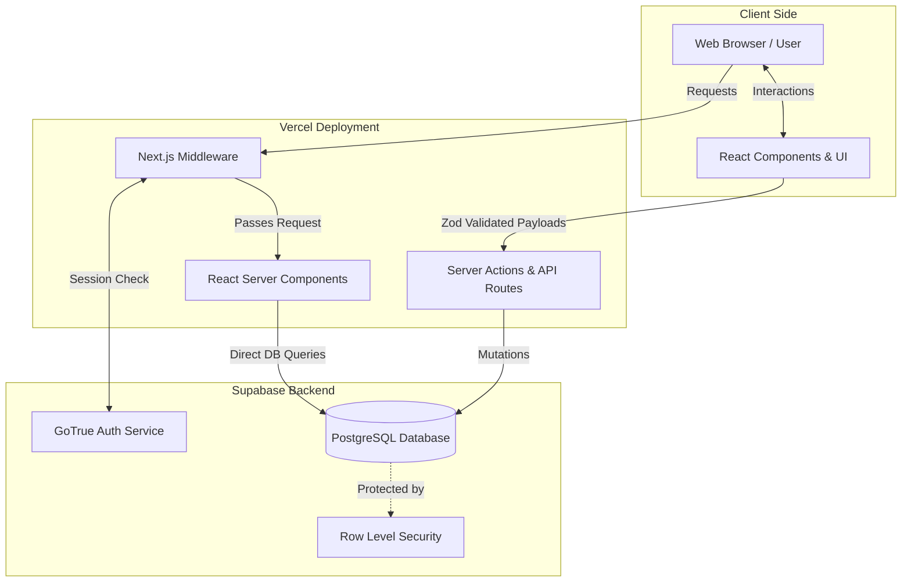

# CarbonTrack

**Live Demo:** [https://eco-track-omega-azure.vercel.app/](https://eco-track-omega-azure.vercel.app/)

CarbonTrack is a production-grade carbon footprint tracker that helps users log daily activities across transport, energy, food, and shopping categories, visualize emissions through interactive charts, and receive personalized reduction insights. Built with TypeScript strict mode, Zod v4 validation, and Supabase Row-Level Security, the codebase prioritizes code quality and security at every layer. React Server Components and edge-ready architecture ensure zero client JS overhead and minimal resource utilization. A comprehensive test suite—Vitest unit tests and Playwright E2E flows—guarantees stability across the full stack. WCAG AA contrast-safe chart palettes, semantic HTML, and responsive layouts make the app highly accessible. The solution provides a seamless 4-category action logging experience and dynamic personalized insights in a polished, deployable package.

## Screenshots





## Features

- **Carbon Action Logging** — Log daily activities across Transport, Energy, Food, and Shopping categories
- **Dashboard** — Visualize emissions over time and category breakdowns with interactive charts
- **Personalized Insights** — AI-powered tips and trend analysis based on your carbon footprint
- **Secure Auth** — Email-based sign-up/login with Supabase Auth and row-level security

## Tech Stack

| Layer | Technology |
| --- | --- |
| Framework | Next.js 16 (App Router) |
| UI | React 19, Tailwind CSS v4, shadcn/ui |
| Language | TypeScript (strict) |
| Database | Supabase (PostgreSQL) |
| Validation | Zod v4 |
| Charts | Recharts v3 |
| Unit Tests | Vitest + Testing Library |
| E2E Tests | Playwright |
| Deployment | Vercel |

## Architecture



## Getting Started

### Prerequisites

- Node.js 18+
- A Supabase project (or local instance)

### Install

```bash
npm install
```

### Environment Setup

Copy the example env file and fill in your Supabase credentials:

```bash
cp .env.example .env
```

Required variables:

| Variable | Description |
| --- | --- |
| NEXT_PUBLIC_SUPABASE_URL | Supabase project URL |
| NEXT_PUBLIC_SUPABASE_PUBLISHABLE_KEY | Supabase anon/publishable key |
| SUPABASE_ANON_KEY | Supabase anon key |
| SUPABASE_JWT_SECRET | Supabase JWT secret |
| SUPABASE_SERVICE_ROLE_KEY | Supabase service role key |
| POSTGRES_* | PostgreSQL connection strings |

### Database

Run the schema against your Supabase/PostgreSQL instance:

```bash
psql $POSTGRES_URL < supabase/schema.sql
```

This creates all required tables (profiles, carbon_actions, carbon_summaries, user_badges, user_goals) with row-level security policies.

### Development

```bash
npm run dev
```

Open http://localhost:3000.

## Scripts

| Command | Description |
| --- | --- |
| npm run dev | Start development server |
| npm run build | Production build |
| npm start | Start production server |
| npm test | Run unit tests (Vitest) |
| npm run test:e2e | Run end-to-end tests (Playwright) |
| npm run lint | Lint with ESLint |

## Project Structure

```text
src/
├── app/                    # Next.js App Router pages
│   ├── (protected)/        # Dashboard, actions, insights, map, settings
│   ├── api/                # API routes for insights
│   └── demo/               # Public demo preview mode
├── components/
│   ├── ui/                 # shadcn/ui primitives (Button, etc.)
│   ├── charts/             # Recharts-based data visualizations
│   ├── landing/            # Landing page sections
│   └── tracking/           # Carbon tracking specific components
├── lib/
│   ├── carbon/             # Calculator, categories, emission factors
│   └── supabase/           # Client, server, and middleware helpers
├── types/                  # TypeScript interfaces
└── middleware.ts           # Supabase session refresh + route protection

tests/                      # Unit & component tests
e2e/                        # Playwright E2E specs
supabase/schema.sql         # Full database schema + RLS policies
```

## Testing

**Unit tests:**

```bash
npm test
```
Covers the carbon calculation models, insights engine, and Zod schema validation.

**E2E tests:**

```bash
npm run test:e2e
```
Tests the full user journey: sign up → log action → view dashboard, plus keyboard navigation.

## Deployment

The project is pre-configured for Vercel. Push to your connected repo and Vercel will auto-deploy.
