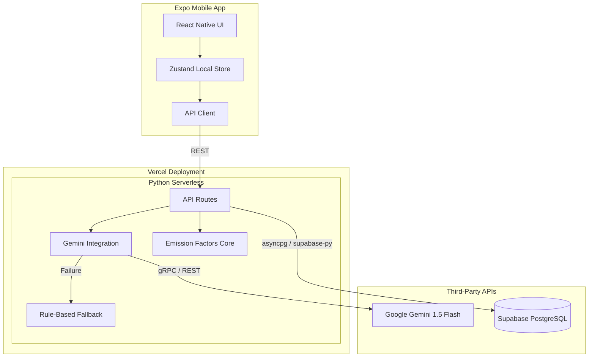

# EcoTrack System Architecture

This document describes the production-grade architecture of the EcoTrack platform.

## 1. System Design Diagram

## 2. Core Modules

### 2.1 React Native Frontend (Expo)
*   **Framework:** Expo SDK, React Native
*   **State Management:** Zustand with `persist` middleware for offline capabilities and caching.
*   **Data Fetching:** Custom API client layer (`apiClient.ts`) interacting with backend.

### 2.2 FastAPI Backend (Vercel)
*   **Framework:** FastAPI
*   **Architecture:** Clean architecture separating routes (`api/`), core configuration (`core/`), database models (`models/`), and business logic (`services/`).
*   **Deployment:** Serverless deployment via Vercel using `@vercel/python`.

### 2.3 AI & Fallback Engine
*   **Primary:** Google Gemini 1.5 Flash via `google-generativeai`.
*   **Fallback:** If the API fails, a rule-based engine (`services/fallback.py`) guarantees a valid, actionable response based on scientific emission factors, ensuring 100% uptime for the user experience.

### 2.4 Data Credibility Layer
*   Uses scientific emission factors sourced from the IPCC, EPA, and DEFRA to ensure calculations are authoritative and mathematically sound.
