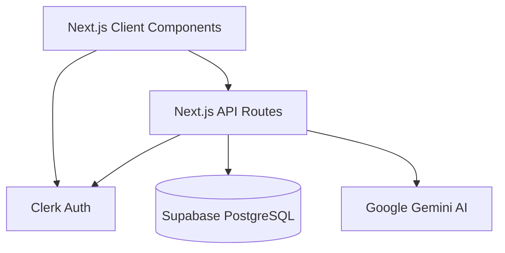

# EcoTrack Platform Architecture

## System Diagram

## Data Flow
1. **Authentication**: Users authenticate via Clerk on the client. The session token is passed to Next.js API Routes.
2. **Database Operations**: API Routes use the Supabase JS client to insert and retrieve data (`users`, `carbon_entries`, `offset_purchases`).
3. **AI Contextualization**: User's recent `carbon_entries` are fetched from Supabase and injected into the Gemini prompt via `@google/genai`.
4. **Gamification**: The `users` table tracks `points`. Points are updated dynamically whenever a `carbon_entry` is added or an offset is purchased.

## Database Schema (Supabase)
- **users**: id (PK), email, name, total_emissions, points
- **carbon_entries**: id (PK), user_id (FK), activity_type, value, co2_amount, date
- **offset_purchases**: id (PK), user_id (FK), project_name, amount_kg, cost, purchased_at

## AI Logic & Fallback
The `POST /api/insights` route attempts to call Gemini via `@google/genai`.
If the Gemini API fails or times out, the backend will catch the error and return static, rule-based recommendations based on the user's highest emission category (e.g., "Consider reducing flights" if flight emissions > 50%).
